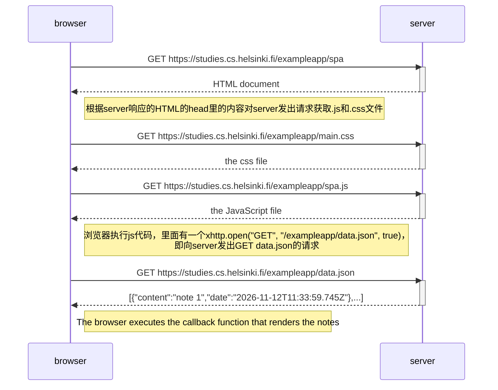

```mermaid
sequenceDiagram
    participant browser
    participant server

    browser->>server: GET https://studies.cs.helsinki.fi/exampleapp/spa
    activate server
    server-->>browser: HTML document
    deactivate server

    note right of browser: 根据server响应的HTML的head里的内容对server发出请求获取.js和.css文件
    browser->>server: GET https://studies.cs.helsinki.fi/exampleapp/main.css
    activate server
    server-->>browser: the css file
    deactivate server

    browser->>server: GET https://studies.cs.helsinki.fi/exampleapp/spa.js
    activate server
    server-->>browser: the JavaScript file
    deactivate server

    note right of browser:浏览器执行js代码，里面有一个xhttp.open("GET", "/exampleapp/data.json", true)，<br>即向server发出GET data.json的请求
    browser->>server: GET https://studies.cs.helsinki.fi/exampleapp/data.json
    activate server
    server-->>browser: [{"content":"note 1","date":"2026-11-12T11:33:59.745Z"},...]
    deactivate server

    Note right of browser: The browser executes the callback function that renders the notes

```